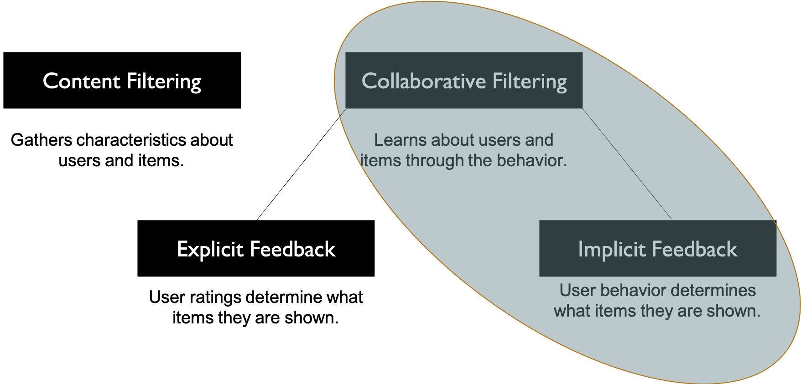
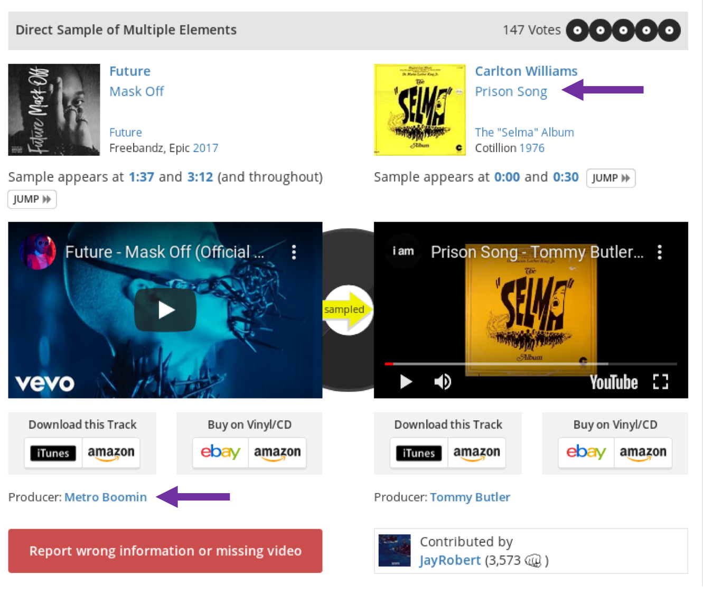
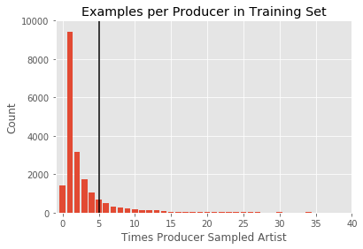

# Recordmend

Recordmend is a tool for music producers that recommends new songs for them to sample based off of their sampling history. 

## What is sampling?

Sampling is the process of reusing portions of older songs in new ones. Also called “crate-digging”, it can involve extensive searching to find a new sound. 

I started making hip hop beats in high school when my parents got their computer fixed, and our computer guy put a terabyte of music on our new computer (he probably wanted to distract us from how much he was overcharging us by). Suddenly I had huge amounts of songs to search through and listen to, and I found that every once in a while, I would make a discovery: There was a perfect sample hidden in one of the songs. I loved those moments.

However, finding those gems could take hours of patient listening. This strategy remains the only way to find new samples, and it means that finding new samples requires a lot of leg work. This leads many producers to only sample the classics (James Brown, for example) and to leave the huge mass of work that is music unsearched.

Recordmender promises to help producers narrow their search down to more promising songs. The leg work wouldn't be gone, but the time of their search could be cut down a great deal. Getting producers to sample from new songs could have the effect of increasing diversity in modern music, introducing younger listeners to a wider selections of songs and increasing cross-pollination across genres and generations.

 

[Madlib is clearly overwhelmed](https://en.wikipedia.org/wiki/Madlib)

## Recommenders help users choose between many options   

The problem of too many options can be addressed using a recommendation engine. Recommenders have become ubiquitous in fields such as movies, Youtube videos, books, and online shopping, where users are presented with millions of options to choose from. At first pass, this may seem to be a positive thing. With more options, one should have a better chance of finding what they want, right? However, psychologists such as Barry Shwartz have argued that more is not always better, dubbing this phenomenom the "Paradox of Choice".2 Although this phenomenon has received increased scientific scrutiny3 recently, it is supported by a 2015 meta-analysis.4 The concept is simple: More options mean more decisions to make, and decision-making can be a mentally exhausting process. If companies can present users with a limited number of appropriate, well-tailored recommendations, they limit the number of decisions the user has to make, thus making the entire purchase process easier and quicker.

## Types of recommendation engines

Recommendation engines are split into two types, <i>content filtering</i> and <i>collaborative filtering</i>. In content filtering, characterists about users and items are entered into the algorithm. But in collaborative filtering, the user's behavior is all that is needed to make recommendations. By monitoring the behavior of its users, companies learn about their users and their items, and are thus able to identify which users will want which things. Furthermore, the user doesn't even need to explicitly rate the items they view- instead, their watch patterns are enough to learn their likes and dislikes. Such a model is referred to as an <i>implicit feedback</i> model, as opposed to an <i> explicit feedback </i> model.

## Methodology

 I created a producer-song utility matrix by scraping 200,000 links from whosampled.com into MongoDB using the Selenium Webdriver in Python. I then decomposed the matrix with Singular Value Decomposition and optimized the two component matrices by Alternating Least Squares in Pandas and Numpy. 

Singular Value Decomposition is a method of decomposing a matrix into two component matrices, whose dimensions are determined by the number of latent factors in the data. The dot product of these matrices is an attempt to reconstitute the original utility matrix. Originally, these models were trained by stochastic gradient descent, in the form of the equation below:

$\underset{x,y}min\underset{u,i}\sum 
c_{ui} (p_{ui} - x_u^Ty_i)^2 + \lambda
(\underset u \sum \parallel x_u \parallel ^2
+\underset u \sum \parallel y_i \parallel ^2)$

##### Where:

* $x_u$ is the first matrix (termed the user vector).
* $y_i$ is the second matrix (termed the item vector).
* $x_u^Ty_i$ is their dot product.

* $p_{ui} = 1$ if producer sampled a song, 0 if producer did not sample a song.

* $c_{ui} =$ our confidence in the data; specifically, the number of times a producer sampled a song. This is calculated as $c_{ui} =1 + \alpha * r_{ui}$, where
$r_{ui}$ = # of interactions for a user-item pair, and $\alpha$ determines our confidence levels.

* $\lambda$ is regularization term.

Like other gradient descent algorithms, this model begins with taking the squared error of our prediction $(p_{ui} - x_u^Ty_i)^2$. It then multiplies our error by our confidence in this prediction, $c_{ui}$, thus increasing the cost of errors on high confidence user-item interactions. Across all  users x and items y, we minimize this cost.

In practice, however, stochastic gradient descent is impossible in implicit feedback. There are often billions of user-item interactions to compute over.

## ALS

Therefore we modify the cost function to Alternating Least Squares, which works by holding either user vectors or item vectors constant and calculating the global minimum, then alternating to the other vector.

### Compute User factors
$x_u = (Y^T C^u Y + \lambda I)^{-1}  Y^T C^u p(u)$

##### Where:

$Y$ is $n * f$ matrix of item-factors. 

$C^u$ is a $n*n$ diagonal matrix for user $u$ where $C^u_{ii} = c_{ui}$. Each $C^u$ is our confidence matrix for $n$ items for $u$ user.

$p(u)$ is vector of preferences for user $u$.

### Recompute Item factors

$y_i = (X^TC^iX + \lambda I)^-1 X^TC^ip(i)$

##### Where:
$X$ = $m * f$ matrix  of user_factors. 

$C^i$ is $m * m$ diagonal matrix for each item $i$ where $C_{uu}^i = c_{ui}$

$p(i)$ is vector of preferences for item $i$.

## Ranking the model

The model was ranked using a ranking algorithm adopted from [Hu 2008](https://ieeexplore.ieee.org/document/4781121). 

$\overline{rank} = \frac{\sum_{u,i} r^t_{ui} * rank_{ui}}{\sum_{u,i} r^t_{ui}}$

##### where:

$r^t_{ui}$ is the # of interactions for observations in the test set.

$rank_{ui}$ are the percentile ranking of each item for each user.

How does this algorithm work? We can see that $\sum_{u,i} r^t_{ui}$ is in both the numerator and the denominator. If $rank_{ui}$ was not in the numerator, $\overline{rank}$ would simply equal 1. $rank_{ui}$ is the percentile ranking of each item for each user, such that the item most highly recommended has a $rank_{ui}$ of 0.00\% and the item least recommended has a $rank_{ui}$ of 100.00\%.

Therefore, if the algorithm is correct, the low percentages will cancel out the higher $r^t_{ui}$, making the $\overline{rank}$ go towards 0.

The item most highly recommended has a $rank_{ui}$ of 0.00\% and the item least recommended has a $rank_{ui}$ of 100.00\%.
$rank_{ui}$ spans from 0 to 1
## Perform Test/Train Split

We can't do a traditional 70/30 split for recommendation systems, because the algorithm requires the entire
dataframe to train on. Instead, we create a test set by taking some percentage of the actual interactions, and 
replacing them with zeros- in other words, acting as if the producer has not sampled those artists.

We train the model on this `train` dataset with these specific values hidden. 

## Making model better

We found that lower # of factors lead to a better rank score. 12 worked the best.

Different regularization values of lambda were tried from 0.01 to 1000.

Different numbers of iterations from 10 to 210, in steps of 40. 

With these best values, different numbers of artists sampled and producers were tried.

## The model performance was hampered by low numbers of training examples for most producers.

## Rank Score got better when producers with few sampled songs (training examples) were included.

## Conclusion and Future steps
My model scores much better than random and is similar to popularity. However, many of its’ recommendations are lacking in diversity. Furthermore, it is not effective for producers with few sampled artists. A multi-level ensemble recommender with content filtering may help to address these problems. 

1. http://www.marsbands.com/2011/10/97-million-and-counting/

2. https://www.scientificamerican.com/article/the-tyranny-of-choice/

3. https://www.pbs.org/newshour/economy/is-the-famous-paradox-of-choic

4. https://www.sciencedirect.com/science/article/abs/pii/S1057740814000916