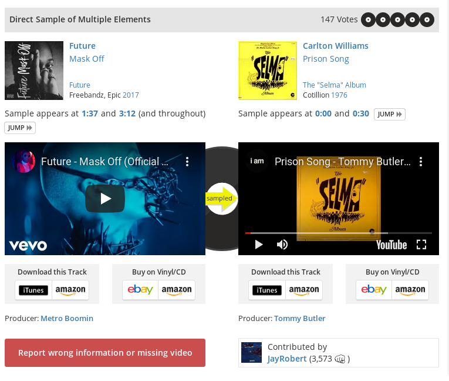

# recordmender


## What are you trying to do? Articulate your objectives using absolutely no jargon (i.e. as if you were explaining to a salesperson, executive, or recruiter).

I am trying to create a recommendation engine for music producers, mainly hip hop producers, that will recommend songs for them to sample (i.e., use parts of the song in their own beats), based off of the previous songs they've sampled, the beats they've produced, and their self-reported beat-making style.

## The steps of the project:

1. Scrape whosampled.com for, say, 1000 producers. The structure of the dataset from whosampled will be as such: 
```
{
  New Song Producer: "string",    
  New Song Artist: "string",
  New Song Name: "string", 
  Sampled Song: "string",
  Sampled Artist: "string",
  Elements Sampled (Voice, Drums, Multiple Elements, etc. [available on whosampled.com]): "string",
  Time in Sampled Song where Sample Appears: "tmstmp" or "int",
  Overall Length of Song: "int",
  Name of Contributor Perhaps (for EDA purposes)? : "string", 
  Presence/ Absence of "and throughout" in sample description: "Boolean"
}
```


## Reason for structure of whosampled dataset

1. Elements Sampled

This feature may make our recommendation engine much stronger/ more specific. It will allow the producer to specifically request an element (drums, voice, etc.) when asking the recordmender for a recommendation. 

1. Time in sample song where sample appears/ Overall Length of Songs: 

  1. General EDA: Plot where in songs samples are taken from, and see what type of distribution represents this. I'm guessing Poisson distribution, since most samples come from the beginning of songs, and the likelihood of a sample decreases as we move further through the song. We could plot this both as an absolute value, i.e., 99% of samples are within first 5 seconds, and as a fraction, i.e., 99% of samples come from the first tenth of the song. To determine the fraction, we need the entire length of the sample song. 
  
  2. We can see whether certain songs have sections that haven't been utilized. For example, a particular song may have been sampled 100 times, but what if it is only at the beginning, and there is much of it that appears unexplored?

## How has this problem been solved before? If you feel like you are addressing a novel issue, what similar problems have been solved, and how are you borrowing from those?
    What is new about your approach, why do you think it will be successful?
    Who cares? If you're successful, what will the impact be?
    How will you present your work?

    Web app - where will you host it, what kind of information will you present?
    Visualization - what final visuals are you aiming to produce?
    Presentation - slides, interpretive dance?

    What are your data sources? What is the size of your dataset, and what is your storage format?
    What are potential problems with your capstone, and what have you done to mitigate these problems?
    What is the next thing you need to work on?

    Getting the data, not just some, likely all?
    Understanding the data?
    Building a minimum viable product?
    Gauging how much signal might be in the data?
