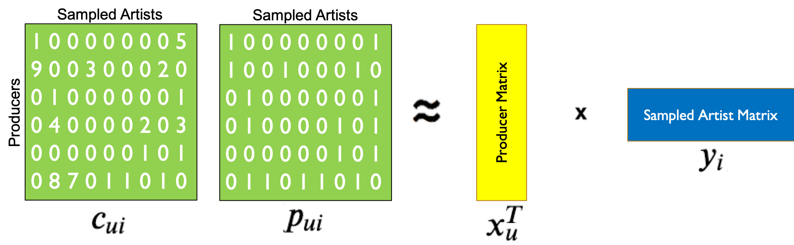
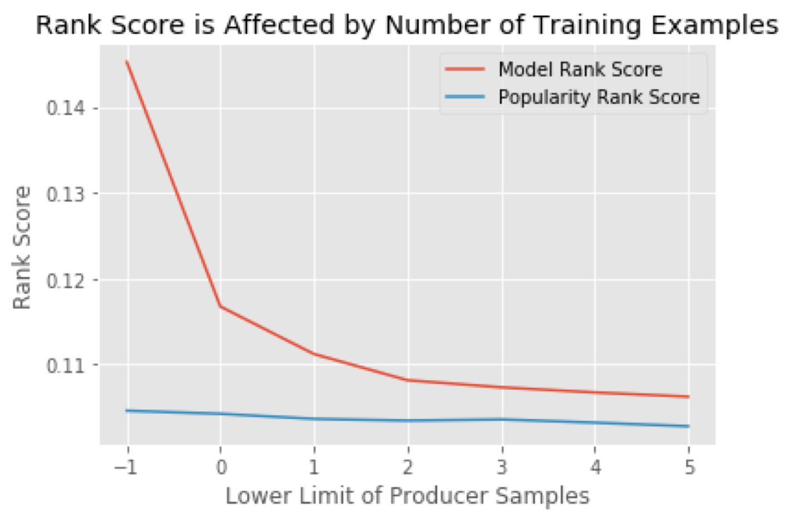

# Recordmend

Recordmend is a tool for music producers that recommends new songs for them to sample based off of their sampling history. 

## What is sampling?

Sampling is the process of reusing portions of older songs in new ones. Also called “crate-digging”, it can involve extensive searching to find a new sound. 

## Methodology

I created a producer-song utility matrix by scraping 200,000 links from whosampled.com into MongoDB using the Selenium Webdriver in Python. 

I then decomposed the matrix with Singular Value Decomposition and optimized the two component matrices by Alternating Least Squares in Pandas and Numpy. Singular Value Decomposition is a method of decomposing a matrix into two component matrices, whose dimensions are determined by the number of latent factors in the data. 

The dot product of these matrices is an attempt to reconstitute the original utility matrix. Originally, these models were trained by stochastic gradient descent, in the form of the equation below:

##### Where:

*  is the first matrix (termed the user vector).
*  is the second matrix (termed the item vector).
*  is their dot product.

*  if producer sampled a song, 0 if producer did not sample a song.

*  our confidence in the data; specifically, the number of times a producer sampled a song. This is calculated as , where
# of interactions for a user-item pair, and  determines our confidence levels.

*  is the regularization term.

Like other gradient descent algorithms, this model begins with taking the squared error of our prediction . It then multiplies our error by our confidence in this prediction, , thus increasing the cost of errors on high confidence user-item interactions. Across all users  and items , we minimize this cost.

In practice, however, implementing stochastic gradient descent is impractical for recommenders, because there are usually billions of user-item interactions to compute over, which is extremely computationally expensive.

## ALS

Therefore we modify the cost function to Alternating Least Squares, which works by holding either user vectors or item vectors constant and calculating the global minimum, then alternating to the other vector.

### Compute User factors

##### Where:

 is  matrix of item-factors. 

 is a  diagonal matrix for user  where . Each  is our confidence matrix for  items for  user.

 is vector of preferences for user .

### Recompute Item factors

##### Where:
 matrix  of user_factors. 

 diagonal matrix for each item  where 

 is vector of preferences for item .

## Ranking the model

The model was ranked using a ranking algorithm adopted from [Hu 2008](https://ieeexplore.ieee.org/document/4781121). 

##### where:

 is the # of interactions for observations in the test set.

 are the percentile ranking of each item for each user.

How does this algorithm work? We can see that is in both the numerator and the denominator. If  was not in the numerator,  would simply equal 1.  is the percentile ranking of each item for each user, such that the item most highly recommended has a  of 0.00\% and the item least recommended has a  of 100.00\%. Therefore, if the algorithm is correct, the low percentages will cancel out the higher , making the  go towards 0. Thus, the item most highly recommended has a  of 0.00\% and the item least recommended has a  of 100.00\%.

## Perform Test/Train Split

We can't do a traditional 70/30 split for recommendation systems, because the algorithm requires the entire
dataframe to train on. Instead, we create a test set by taking some percentage of the actual interactions, and 
replacing them with zeros- in other words, acting as if the producer has not sampled those artists.

We train the model on this `train` dataset with these specific values hidden. 

## Rank Score got better when producers with few sampled songs (training examples) were excluded.

## Grid Searching the model

I found that 20 factors, a lambda of 30, and 50 iterations gave the best rank score. 

## Conclusion and Future steps
My model scores much better than random and is similar to popularity. However, it is not effective for producers with few sampled artists. A multi-level ensemble recommender with content filtering may help to address these problems. 

1. https://www.scientificamerican.com/article/the-tyranny-of-choice/

2. https://www.pbs.org/newshour/economy/is-the-famous-paradox-of-choic

3. https://www.sciencedirect.com/science/article/abs/pii/S1057740814000916
