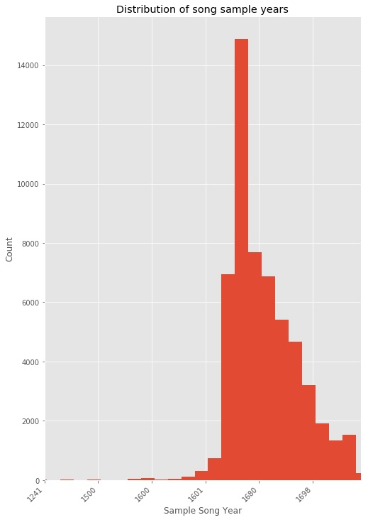

Recordmend is a tool for music producers that helps them find songs to sample for their next beat. It uses an implicit feedback, collaborative filtering approach to create its recommendations. Data for the recommender was scraped from whosampled.com into MongoDB using Selenium. This user-item utility matrix, where each cell's value represents the number of times a producer sampled an artist, was analyzed in Pandas and Numpy. A latent factor model with Singular Value Decomposition, trained using Alternating Least Squares, was used to create the recommendations.

# Recordmend

Recordmend is a tool for hip hop producers that recommends new songs for them to sample based off of their sampling history. 

## What is sampling?

Sampling is the process of reusing portions of older songs in new ones. Also called “crate-digging”, it can involve extensive searching to find a new sound. However, it has been estimated that there are as many as 100 million recorded songs in the world. This overwhelming number of options can discourage producers from searching out new possibilities.1

## Recommenders help users choose between many options   

Recommendation engines have become ubiquitous in fields such as movies, Youtube videos, books, and online shopping. In these fields, users are presented with millions of options to choose from, which at first pass would seem to be a positive thing. With more options, one should have a better chance of finding what they want, right? However, psychologists such as Barry Shwartz have argued that more is not always better, dubbing this phenomenom the "Paradox of Choice".2 Although this phenomenon has received increased scientific scrutiny3 recently, it is supported by a 2015 meta-analysis.4 The concept is simple: More options mean more decisions to make, and decision-making can be a mentally exhausting process. If companies can present users with a limited number of appropriate, well-tailored recommendations, they limit the number of decisions the user has to make, thus making the entire purchase or process easier and quicker.

## Types of recommendation engines

Recommendation engines are split into two types, content filtering and collaborative filtering. In content filtering, characterists about users and items are entered into the algorithm and used 
## Rationale

Digging in the crates. Sampling. Flipping. Finding a gem in an old song to repurpose in a new one can be quite the thrill. It's like finding buried treasure.

Before discovery, however, comes a whole lot of searching. Listening to song after song, trying to find the secret gems hidden therein. 

[Madlib](https://en.wikipedia.org/wiki/Madlib)

As in the rest of life, the journey is more important than the destination. Yet most explorers travel with a map. Recordmend is that map. 

## Methodology

Data scraped from [WhoSampled](WhoSampled.com) was used to construct a utility matrix $R$ with $P$ rows and $A$ columns, which are the number of unique producers and unique sampled artists in the dataset, respectively. $R_{p,a}$ thus represents the number of times a given producer $p$ sampled an artist $a$, ranging from 0 to 131.

Singular Value Decomposition is a latent factor model which causes dimensionality reduction. Two matrices are created, a user-factor matrix and an item-factor matrix, where the factor represents the number of latent factors in the data. The dot product of these matrices is an attempt to reconstitute the original utility matrix. Originally, these models were trained by stochastic gradient descent, in the form of the equation below:

$\underset{x,y}min\underset{u,i}\sum 
c_{ui} (p_{ui} - x_u^Ty_i)^2 + \lambda
(\underset u \sum \parallel x_u \parallel ^2
+\underset u \sum \parallel y_i \parallel ^2)$

##### Where:

* $x_u$ is user vector
* $y_i$ is item vector
* $x_u^Ty_i$ is their dot product.

* $p_{ui} = 1$ if interaction, 0 if no interaction.

* $c_{ui} =$ our confidence in the data; in our case, the number of times a producer sampled a artist. This is calculated as $c_{ui} =1 + \alpha * r_{ui}$, where
$r_{ui}$ = # of interactions for a user-item pair, and $\alpha$ determines our confidence levels.

* $\lambda$ is regularization term.

Like other gradient descent algorithms, this model begins with taking the squared error of our prediction $(p_{ui} - x_u^Ty_i)^2$. It then multiplies our error by our confidence in this prediction, $c_{ui}$, thus increasing the cost of errors on high confidence user-item interactions. Across all or a subset of users x and items y, we minimize this cost.

In practice, however, stochastic gradient descent is impossible in implicit feedback. There are often billions of user-item interactions to compute over.

## ALS

Therefore we modify the cost function to Alternating Least Squares, which works by holding either user vectors or item vectors constant and calculating the global minimum, then alternating to the other vector.

### Compute User factors
$x_u = (Y^T C^u Y + \lambda I)^{-1}  Y^T C^u p(u)$

##### Where:

$Y$ is $n * f$ matrix of item-factors. 

$C^u$ is a $n*n$ diagonal matrix for user $u$ where $C^u_{ii} = c_{ui}$. Each $C^u$ is our confidence matrix for $n$ items for $u$ user.

$p(u)$ is vector of preferences for user $u$.

### Recompute Item factors

$y_i = (X^TC^iX + \lambda I)^-1 X^TC^ip(i)$

##### Where:
$X$ = $m * f$ matrix  of user_factors. 

$C^i$ is $m * m$ diagonal matrix for each item $i$ where $C_{uu}^i = c_{ui}$

$p(i)$ is vector of preferences for item $i$.

## Data Collection

A Selenium class was created to scrape the data from whosampled.com

## EDA

## Making model better

We found that lower # of factors lead to a better rank score. 12 worked the best.

Different regularization values of lambda were tried from 0.01 to 1000.

Different numbers of iterations from 10 to 210, in steps of 40. 

With these best values, different numbers of artists sampled and producers were tried.

Specific elements sampled were also examined.
#Specific to do's for Thursday/ Friday
1. Look at none listed for new song producer. Consider replacing with new_song_artist

3. Examine features of model. Clustering of items. Recommendations. 

Try other algorithms- random forest....

Make a playlist of the 6game on whosampled- it takes a random progression through music.

1. http://www.marsbands.com/2011/10/97-million-and-counting/

2. https://www.scientificamerican.com/article/the-tyranny-of-choice/

3. https://www.pbs.org/newshour/economy/is-the-famous-paradox-of-choic

4. https://www.sciencedirect.com/science/article/abs/pii/S1057740814000916